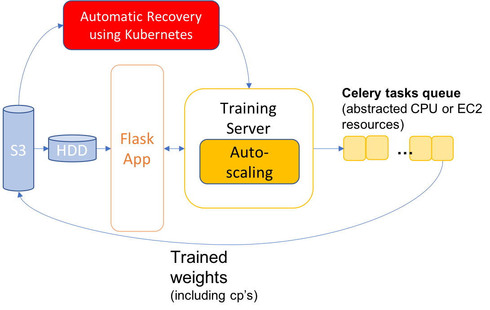

# server-fail-tolerant-image-transfer-learning
- This repo builds on another project called [Michaniki](https://github.com/InsightDataCommunity/Michaniki), which implemented a web platform that enables automated image classification transfer learning service. 

### Project Idea
In this repo, I will enable GPU computing on AWS for training on images and implement automatic recovery mechanism to support EC2 Spot Instances for lower costs.

### Purpose
[Michaniki](https://github.com/InsightDataCommunity/Michaniki) provides three functionalities:
1. User inputs an image via client application, an Inference Server outputs image class.
2. User inputs an image dataset stored on a S3 server, a Training Server applies transfer learning on pre-trained CNN models and returns the new model trained on custom images
3. User inputs testing images stored on S3, and Inference Server outputs predictions using newly trained model.

This platform is intended for computer vision research and personal use. Transfer learning in image classification has become a standard practice, and a web platform that automates the task can save every user 1-2 hours writing basic code that are more similar than not. 

However, this platform currently uses local CPU resources for training, which can be time assuming especially if the dataset is large. I will enable training on GPU by instantiating multiple AWS EC2's while ensuring auto-scaling of resources. This upgrade would speed up training significantly. \#TODO: measure real-time speedup

On-Demand EC2 Instances with GPU are expensive, and this cost can be reduced up to 4x by using EC2 Spot services. The problem with EC2 Spot Instances is that servers are more prone to be interrupted, possibly causing training process to be aborted unexpectedly. Thus a fault-tolerant platform is required. I will implement automatic recovery for the Training Server that will store and pick up previous checkpoints to resume training in cases of cloud server failure.

### Architecture

### Tools/Technologies
- Docker
- Kubernetes
- Celery
- Keras+Tensorflow
