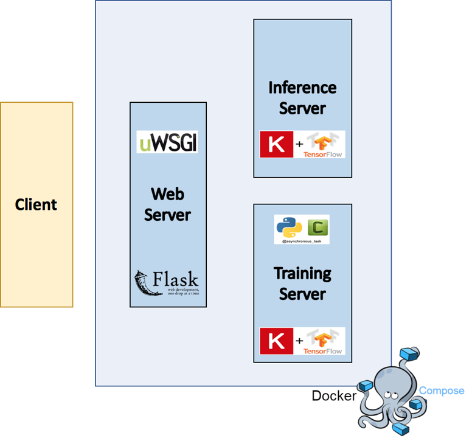
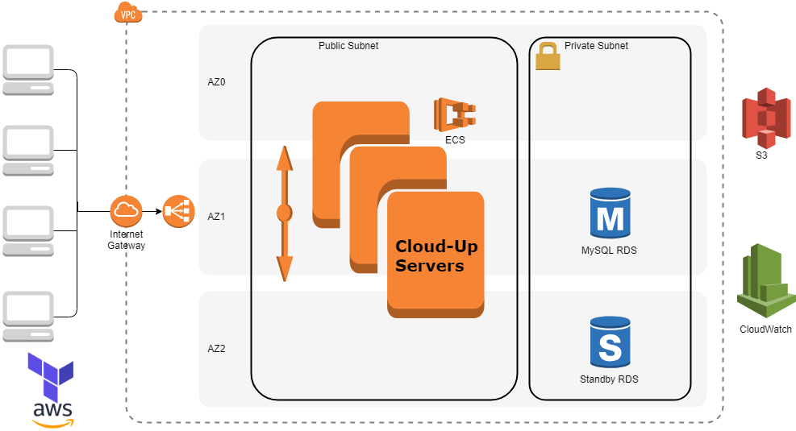
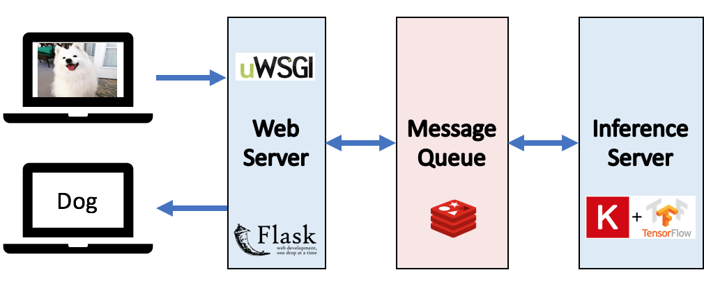
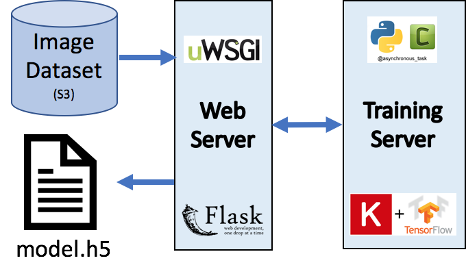

# Cloud-Up: Scalable and Secure Infrastructure for Transfer Learning as a Service
Check out my product in this [link](https://1drv.ms/f/s!AmrtnAcSGR3oiKBX6NLq1YwmFLSzYw) and visit the [slides](https://docs.google.com/presentation/d/1svaXXbzNHJ4pErcu5d19rBu0Hn1Xh79UVCnyU2Jpo1k/edit?usp=sharing) for more details. This web app lets you to train your own image classifiers!

### Purpose
The old Michaniki project runs on local host machine. This can be a limiting factor for users who don't have access to GPU enabled computer, thus will suffer from long training times. In this repo, I enable GPU computing on AWS for training classification models. I also automatically deploy a scalable infrastructure on a single click to provide multi-user services.

This platform is intended for anyone who needs image classification. Transfer learning in image classification has become a standard practice, and a web platform that automates the task can benefit users who do not have computing resource or domain knowledge. 

### Web App Architecture

### System Infrastructure

### Dataflows
1. User inputs images via client application, an Inference Server outputs image class.

2. User inputs image dataset stored on S3, a Training Server applies transfer learning on pre-trained CNN models and returns the new model trained on custom images

3. User inputs testing images stored on S3, and Inference Server outputs predictions using newly trained model.

### Tools/Technologies
Containerization: Docker  
Orchestration: ECS  
Provisioning: Terraform  
Application: Flask  

### Credit
This repo built upon [Michaniki](https://github.com/InsightDataCommunity/Michaniki), which provided the main features on the application level, including image classification and transfer learning. However, Michaniki ran on local host machine, which is both resource intensive and time consuming, especially if training on a large dataset. 

My contributions include automatic deployment of the application on AWS, auto scaling for efficient resource management, and building web UI for visual appeal and ease of use.
